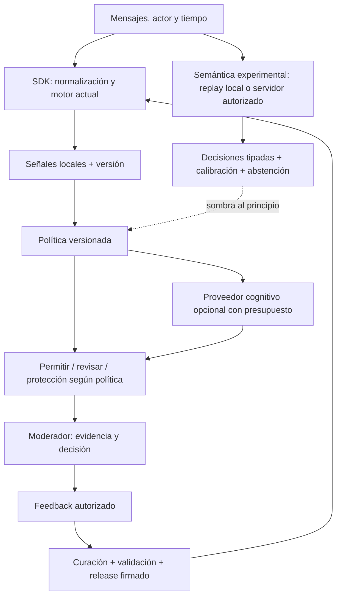

# Arquitectura objetivo y transición

## Mantener lo útil

Conservar TypeScript en dispositivo y FastAPI/SQLAlchemy en servidor, las capas existentes, artefactos firmados, modelos sombra y scripts de comparación. Un monolito modular y tareas batch son suficientes para este ciclo. No añadir una base vectorial, un broker o un framework multiagente sin una necesidad medida.



La semántica nueva empieza en replay offline o servicio experimental separado. No cargar un modelo de cientos de MB en todos los navegadores por defecto. Un modelo local en el Mac del desarrollador no prueba viabilidad en el teléfono de un usuario. Solo portar a ONNX/WebGPU después de medir mejora, RAM, paquete, arranque y latencia en equipo objetivo.

## Componentes y contratos propuestos

| Componente | Extender | Contrato / invariante |
|---|---|---|
| Captura | `Sentinel.analyze`, tipos actuales | mensajes acotados, actor seudónimo, timestamps, contexto conocido; no inferir edad |
| Señales | `engine.ts`, featurizer | evidencia por capa, IDs de reglas y mensajes, versiones; señales no equivalen a hechos probados |
| Proveedor semántico | nuevo adaptador junto a `model-training` para evaluación; servidor solo después | `predict(state, questionSetVersion) -> decisions` con enum/score, estado inválido/timeout y provenance |
| Calibración | scripts de comparación existentes | calibrador separado, revisión de dataset, parámetros y hash; sin test final en ajuste |
| Política | escalación + intervención existentes | `mode=shadow/review/enforce`, versión, límites, abstención; default nuevo en shadow |
| Revisión | dashboard existente | caso pendiente, motivo verificable, desacuerdo, decisión y apelación/corrección |
| Releases | firmas/modelos/packs actuales | artefacto inmutable, checksum, versión, evaluación asociada y rollback |
| Jobs | scripts locales y scheduler externo del cliente | idempotencia, límite, checkpoint, log, exit code; cero LLM para esperar |

Contrato de decisión orientativo, sujeto a S05:

```json
{
  "schema_version": 1,
  "mode": "shadow",
  "case_ref": "opaque-local-id",
  "signals": [{"kind": "isolation_request", "state": "unknown", "evidence_refs": []}],
  "risk_band": "UNKNOWN",
  "disposition": "REVIEW",
  "uncertainty": {"calibrated": false, "reason": "insufficient_context"},
  "versions": {"engine": "...", "pack": "...", "model": "...", "policy": "..."}
}
```

`UNKNOWN` es una propuesta para un nuevo contrato, no un valor actualmente admitido en `RiskLevel`. Mantener adaptador compatible y migración explícita; no romper SDK/API agregando enums sin pruebas. Evidencias deben apuntar a mensajes existentes, nunca a spans inventados por un LLM.

## Cambios de lógica prioritarios

- **Cobertura LOW:** medir el modelo nuevo sobre TODO el corpus. En producción experimental, replay consentido o muestreo aleatorio de LOW con probabilidad registrada; nunca subir todo el texto por un cambio silencioso de default.
- **Caché:** clave y vencimiento deben incluir contenido/contexto relevante, política, pack/modelo y edad conocida. Nuevos mensajes con nuevas señales invalidan aunque la banda no cambie. Separar deduplicación de solicitudes idénticas de reutilización de veredictos.
- **Incertidumbre:** una regla confiable a nivel técnico no acredita su precisión poblacional. Registrar desacuerdos con el piso actual; revisar reglas con datos adjudicados en lugar de dejar que un LLM las borre arbitrariamente.
- **Error de proveedor:** timeout/error debe producir estado explícito. Mantener protección fundada en señales existentes, sin convertir indisponibilidad en nueva acusación o bloqueo universal.
- **Intervención:** separar detección, sugerencia y ejecución del cliente. En el piloto nuevo, solo revisión humana; promociones a acciones automáticas requieren otro gate.

## Datos y aislamiento

En dispositivo: historial mínimo en memoria y memoria agregada opcional con TTL. En servidor: únicamente lo requerido por la integración consentida; la telemetría agregada no sustituye controles de acceso.

Antes de múltiples clientes: auditar sesiones, mensajes, evidencia, feedback, candidatos, informes y red. Identidad de cliente debe derivarse de la credencial verificada, nunca de un campo de usuario. Usar namespaces HMAC por cliente para actores; no correlacionar personas entre organizaciones. Las claves admin de larga duración no van en navegador. Una opción inicial más barata es **instancia aislada por piloto**, hasta que multitenancy tenga pruebas con dos clientes y IDs iguales.

El evidence kit existente tiene hash y legal hold; no prometer admisibilidad judicial ni anonimato irreversible. Definir acceso, borrado, retención de copias y excepciones documentadas. Recursos de ayuda y notificación a tutores requieren revisión experta y actualización; no automatizar contactos externos desde prompts de implementación.

## Operación y escala por etapas

1. Local: fixtures, DB temporal, cero coste de API; release candidato reproducible.
2. Un piloto supervisado: instancia aislada, límites de volumen, presupuesto, logs sin contenido por defecto, backup/restore probado y responsable humano.
3. Solo con demanda: multiempresa, cola de trabajos duradera y SLO contractuales.

Presupuestos propuestos: conservar el gate local actual p95 <8 ms en la máquina registrada; medir semántica por separado (objetivo exploratorio p95 <500 ms caliente, no gate universal). Reportar arranque frío, p99, errores y carga concurrente. Ninguna cifra de laptop acredita móviles o servidor compartido.
