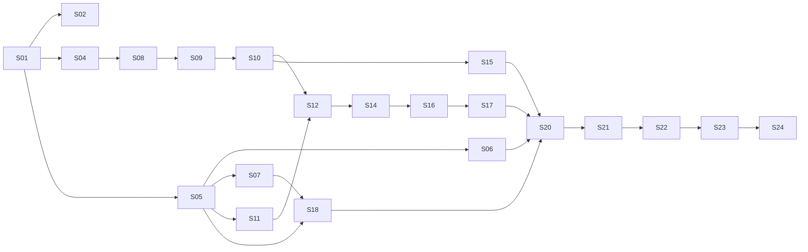

# Roadmap de ocho semanas

Supuesto pendiente de confirmación: 8–12 horas/semana, suscripciones existentes y gasto de infraestructura mínimo. **81 horas orientativas de ruta principal + 6 opcionales**, incluyendo unas 14 horas de trabajo humano de datos en S04/S09. Si un experto externo no está disponible, el calendario se desplaza; un agente no sustituye esa revisión. Las estimaciones son horas de atención/ejecución de trabajo, no tiempos garantizados de generación de IA.

## Semanas relativas al inicio

| Semana | Resultado | Tareas principales | Gate |
|---|---|---|---|
| 1 | Base reproducible y definición de uso | S01–S04; iniciar obtención de colaboración experta | G0 y rúbrica propuesta |
| 2 | Contratos y fronteras seguras | S05–S07 | Cache validada y aislamiento decidido |
| 3 | Datos trazables | S08, primera mitad S09, preparar S10 | Sin fuga de familias |
| 4 | Datos adjudicados y comparación lista | resto S09, S10–S12; continuar semana siguiente si excede cuota | G1/G2; primer resultado Laya |
| 5 | Decisión experimental y tiempo | S14–S16; S13 solo si cabe | Candidato justificado o resultado negativo |
| 6 | Flujo humano útil | S17–S18; S19 opcional | Revisar/corregir con auditoría |
| 7 | Endurecimiento y operación | S20–S21; resolver pendientes | G4 técnico; rollback ensayado |
| 8 | Demo y decisión de piloto | S22–S24 | Demo reproducible; go/no-go explícito |

Las semanas son bandas, no ocho sprints rígidos. S09 se reparte en sesiones humanas cortas. En una semana saturada, ejecutar un solo prompt. No iniciar S16 con un candidato fallido para cumplir calendario: integrar el contrato con stub y mantener motor actual.

## Dependencias y camino crítico

El registro exacto de dependencias está en `tasks.json`; este diagrama resume las principales. S03 es descubrimiento de producto y alimenta S23; S13/S19 son opcionales. Si datos/expertos bloquean el camino, continuar contratos, aislamiento, caché, UI con fixtures y demo técnica; no declarar validado el modelo.

## Política de recorte

A 6 h/semana: mantener S01–S12 y demo del motor actual; mover candidato runtime, UI avanzada y piloto a otro ciclo. Si no hay GPU/RAM, conservar lineal/hash y comparación CPU; no comprar hardware para cumplir el plan. Si no hay datos externos, producir benchmark exploratorio y ficha de límites; no inventar piloto. Si el modelo no gana, cerrar S14 con no-go y seguir calidad de datos/producto.

No presupuestar más de dos candidatos nuevos en este ciclo. S13 (Kev) y S19 (deriva avanzada) se cancelan primero. No recortar aislamiento, trazabilidad, test de regresión o documentación de resultados negativos.

## Dos presupuestos distintos

Cuota de agentes: tareas acotadas, scripts para rutinas, modelo pequeño para documentación mecánica y checkpoints para cómputo largo. API/hosting: gasto monetario por inferencia/servidor, independiente de la suscripción del agente de programación. No asumir que pagar Codex/Copilot incluye créditos de producción.

Escenario inicial de planificación, **no cotización**: cero API y cero hosting incremental mientras se trabaja con fixtures y modelos ya disponibles; techo propuesto USD 25–50/mes para un piloto pequeño si Luis lo acepta. No reservar servidores ni contratar servicios desde este plan.

Costo mensual a registrar:

`hosting + almacenamiento + llamadas × (tokens_entrada × tarifa_entrada + tokens_salida × tarifa_salida)/1e6 + tiempo_de_revisión × costo_hora`

Medir escalaciones y cache hits reales, tokens por conversación, cold start y minutos de revisión. El costo humano puede dominar. El dashboard debe advertir al 70%/90% del presupuesto y aplicar el límite acordado; quedarse sin presupuesto produce un estado degradado explícito, no una etiqueta benigna inventada.

## Cadencia de decisión

Cada dos semanas, máximo 30 minutos: leer resultados y bloqueos, revisar como máximo tres fuentes primarias nuevas y decidir continuar/cambiar/descartar. Cualquier cambio necesita un ADR con impacto en tareas y métricas. No replanificar todo por cada lanzamiento de modelo.
