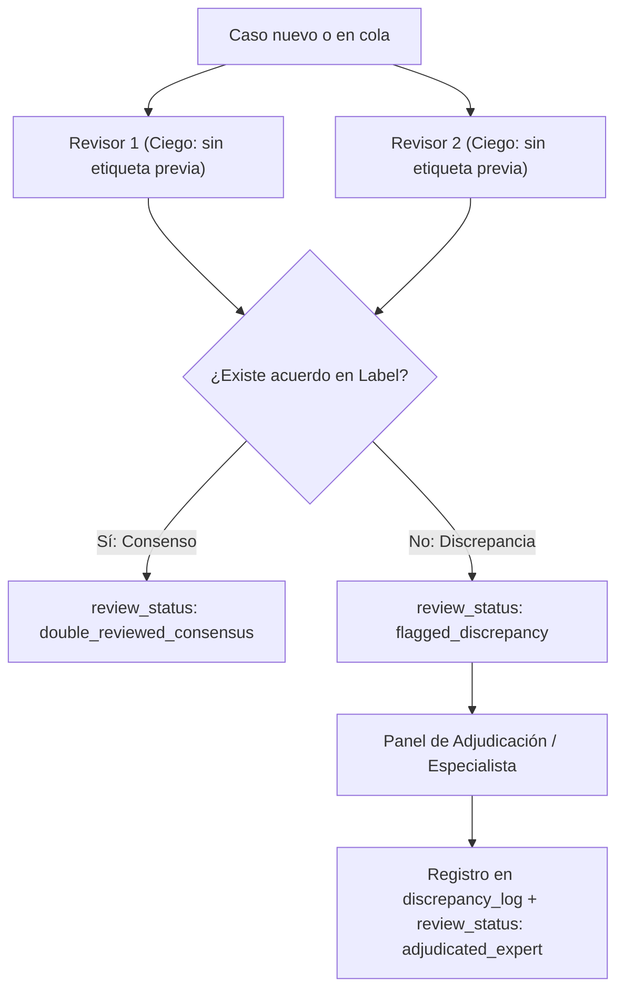

# Rúbrica Mexicana y Protocolo de Anotación (v1.0)

Fecha: 2026-09-28.
Ámbito: Corpus y datasets de Sentinel para la detección temprana de captación e instrumentalización de menores en español mexicano.

---

## 1. Principios Fundamentales y Salvaguardas Éticas

1. **No Discriminación Cultural ni Regional:** El uso de léxico coloquial, modismos mexicanos, referencias a música regional, videojuegos o expresiones juveniles jamás constituye por sí solo evidencia de actividad delictiva o pertenencia criminal.
2. **Conducta sobre Léxico:** La evaluación se fundamenta en **patrones de interacción y conducta dirigida** (vigilancia, aislamiento, coerción, logística ilícita, triangulación forzada), no en la presencia aislada de palabras sensibles.
3. **Preservación de la Incertidumbre (`INSUFFICIENT_CONTEXT`):** Si una conversación no contiene evidencia suficiente para determinar lícita o ilícitamente el propósito de un encargo, está prohibido forzar una clasificación binaria.
4. **Independencia de la Revisión Humana:** La IA nunca puede auto-adjudicarse una revisión humana. Todo estado de revisión (`single_reviewed`, `double_reviewed_consensus`, `adjudicated_expert`) requiere revisores humanos seudónimos identificados.

---

## 2. Definición de Clases de Anotación

### A. `BENIGN` (Sin riesgo de captación)
La conversación refleja intercambios cotidianos, lícitos, de entretenimiento o comunitarios.

- **Indicadores y contextos benignos:**
  - **Jerga y modismos coloquiales:** Uso de términos como *paro, bisne, jale, lana, tirar esquina* en contextos de favores cotidianos, changarros legítimos o tareas escolares.
  - **Gaming y cultura digital:** Referencias a *armas, skins, clanes, matar, lootear* dentro de videojuegos (Free Fire, Roblox, Fortnite, etc.).
  - **Narcocultura y medios como consumo cultural:** Citas de letras de canciones, corridos, series de streaming o noticias sin que exista un reclutador dirigiéndose al menor.
  - **Supervisión familiar:** Presencia o mención proactiva de padres, tutores o maestros como parte del acuerdo o interacción.
  - **Reporte de terceros:** Conversaciones donde los participantes comentan hechos de violencia o noticias locales sin estar involucrados en reclutamiento.
  - **Rechazo explícito:** Situaciones donde el menor niega categóricamente una oferta sospechosa y busca protección de un adulto seguro.

### B. `RISK` (Patrón de captación / instrumentalización)
La conversación demuestra una secuencia dirigida donde un actor busca involucrar, condicionar, coaccionar o instrumentalizar a una persona menor de edad en actividades de riesgo o ilícitas.

- **Conductas observables (`behavior_targets`):**
  - **Vigilancia dirigida (`surveillance_halconeo`):** Encargo de monitorear patrullajes, instalaciones o personas a cambio de dinero/recargas.
  - **Traslado ilícito (`illicit_transport_mula`):** Instrucción de transportar paquetes u objetos cerrados con prohibición explícita de abrir o preguntar su contenido.
  - **Coerción y servidumbre por deuda (`coercive_debt_bonding`):** Aprovechamiento de deudas de juego, apuestas o favores previos para forzar tareas bajo amenaza a la familia o integridad.
  - **Aislamiento y secreto forzado (`isolation_secrecy_recruitment`):** Exigencia reiterada de ocultar la relación a los padres a cambio de promesas de dinero, protección o estatus.
  - **Ofertas laborales engañosas (`fake_job_offer_trafficking`):** Propuestas de empleo con remuneración desproporcionada, sin requisitos claros y con solicitud de traslado en solitario.
  - **Triangulación de canales y destrucción de evidencia (`channel_triangulation_evasion`):** Presión inmediata para abandonar la plataforma hacia canales cifrados no moderados combinada con orden de borrar el historial.

### C. `INSUFFICIENT_CONTEXT` (Contexto insuficiente / ambiguo)
La conversación está incompleta, truncada o describe un encargo atípico que no aporta elementos para descartar ni confirmar una intención lesiva sin suponer hechos externos.

---

## 3. Metadatos de Linaje, Procedencia y Agrupamiento

Para garantizar que no exista fuga de información en los splits de machine learning y auditorías:

1. **`family_id`:** Agrupa una conversación raíz junto con todas sus variantes sintéticas, paráfrasis o pares contrastivos. **Toda la familia debe asignarse obligatoriamente al mismo split** (train, validation o test).
2. **`parent_id`:** Indica el `case_id` del caso original a partir del cual se derivó la mutación (o `null` si es el caso original).
3. **`source_type`:** Clasifica el origen (`synthetic_authored`, `adversarial_paraphrase`, `contrastive_pair`, `deidentified_sample`, `curated_negative`).
4. **`reviewers`:** Arreglo con identificadores seudónimos (`rev_XXXX`). Está terminantemente prohibido incluir identificadores de modelos o scripts como revisores humanos.

---

## 4. Anotación Temporal y Roles por Turno

Cada mensaje del diálogo se desglosa con:
- **`role`:** Rol inferido del emisor (`potential_perpetrator`, `target_minor`, `bystander_peer`, `adult_supervisor`, `unknown`).
- **`first_signal_turn`:** Índice del mensaje donde aparece la primera señal sospechosa preliminar (e.g. adulación asimétrica, oferta monetaria).
- **`critical_event_turn`:** Índice del mensaje donde se concreta el encargo, la exigencia de secreto o la coacción.

---

## 5. Protocolo de Doble Revisión Ciega y Adjudicación

1. **Lectura Ciega Inicial:** Los revisores evalúan el diálogo con la etiqueta original y la predicción del modelo ocultas para evitar sesgos de anclaje.
2. **Muestreo para Doble Revisión:**
   - 100% de los casos de frontera semántica y reclutamiento parafraseado (`RP-*`).
   - 100% de los hard negatives con términos sensibles (`BT-*`).
   - Muestra aleatoria del 20% de los casos restantes.
3. **Manejo de Desacuerdos:** Todo caso con discrepancia se registra en `discrepancy_log` con las justificaciones individuales y es sometido a adjudicación por un especialista en protección infantil.
