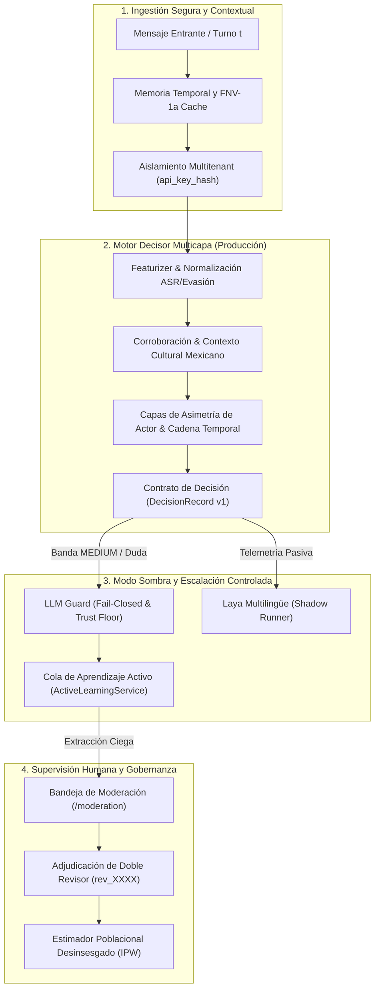

# Dossier Técnico y Guion de Demostración para Foro (S22)
**Sentinel: Detección Temprana y Protección Supervisada de Menores en México**

---

## 1. Resumen Ejecutivo / Executive Summary

### Español
Sentinel es una infraestructura de seguridad digital y moderación diseñada específicamente para detectar patrones de captación, cooptación y explotación de menores en plataformas de mensajería y gaming en México. A diferencia de filtros léxicos genéricos o modelos opacos en la nube, Sentinel combina:
1. Un **motor multicapa determinista y culturalmente contextualizado** que distingue jerga juvenil y consumo musical de amenazas reales con **0 falsos bloqueos**.
2. **Evaluación temporal incremental (prefijo a prefijo)** que detecta señales tempranas antes de eventos críticos sin fuga de datos futuros.
3. Una **bandeja de moderación humana asistida y aprendizaje activo desinsesgado (IPW)** que corrige el sesgo de selección y mantiene al humano como árbitro soberano de veredictos.
4. **Resiliencia fail-closed, multitenancy aislado criptográficamente y cero telemetría con PII**, operando con máxima privacidad por diseño.

### English
Sentinel is a digital safety and moderation infrastructure specifically engineered to detect child grooming, recruitment, and exploitation patterns across messaging and gaming platforms in Mexico. Unlike generic keyword filters or black-box cloud APIs, Sentinel provides:
1. A **deterministic, culturally contextualized multi-layer engine** that differentiates Mexican youth slang and music references from real threats with **0 false blocks**.
2. **Incremental temporal prefix evaluation** that catches early grooming stages before critical escalation turns without future information leakage.
3. An **assisted human moderation tray with debiased active learning (IPW)** that counteracts sampling bias and guarantees human agency in high-stakes decisions.
4. **Fail-closed resilience, cryptographically salted multi-tenant isolation, and zero-PII telemetry**, guaranteeing absolute privacy by design.

---

## 2. Diagrama de Arquitectura y Flujo de Decisión



---

## 3. Guion de Demostración de 7 Minutos (5 Escenarios)

| Minuto | Escenario / Tema | Acción en Demostración | Mensaje Clave |
|---|---|---|---|
| **00:00 - 01:00** | **Introducción & Problema** | Presentar el problema de captación de menores en México y limitaciones de filtros de palabras clave. | Sentinel protege a menores entendiendo el dialecto local sin invadir privacidad. |
| **01:00 - 02:15** | **Escenario 1: Par Contrastivo Cultural** | Ejecutar `SCENARIO-01-CONTRASTIVE-PAIR` (canción de corrido vs oferta de chofer con traslado). | Cero bloqueos falsos ante jerga y música; alerta precisa ante captación dirigida. |
| **02:15 - 03:30** | **Escenario 2: Detección Temprana Temporal** | Mostrar `SCENARIO-02-TEMPORAL-EVOLUTION` turno a turno ($t_0 \dots t_4$). | El riesgo se acumula de forma causal; se alerta antes del evento crítico sin falsas alarmas en $t=0$. |
| **03:30 - 04:30** | **Escenario 3: Abstención y Ambigüedad** | Demostrar `SCENARIO-03-ABSTENTION-AMBIGUITY` emitiendo `SILENT_OBSERVE` / `UNKNOWN`. | Cuando el contexto es insuficiente, el sistema se abstiene y observa en vez de censurar. |
| **04:30 - 05:45** | **Escenario 4: Bandeja de Moderación & IPW** | Mostrar interfaz `/moderation`, revisión doble ciega y corrección de prevalencia IPW. | Los humanos moderan sin sesgo de anclaje y la métrica poblacional está desinsesgada. |
| **05:45 - 07:00** | **Escenario 5: Kill Switch & Conclusiones** | Simular `SENTINEL_SHADOW_ENABLED=false` y fallo de red con fallback fail-closed. | Máxima resiliencia operativa: fallos en IA no degradan la seguridad de los menores. |

---

## 4. Tabla Consolidada de Resultados y Métricas Medidas

| Métrica / Dimensión | Línea Base Determinista | Laya Multilingüe (Sombra) | Meta / Criterio Aceptación | Evidencia Verificada |
|---|---|---|---|---|
| **Falsos Bloqueos (Acción no justificada)** | **0 FB** | **0 FB** | $\le 0\text{ FB}$ | S01, S10, S14, S20 |
| **Recall en Casos Revisados ($N=185$)** | **59.8%** $[52.6\%, 66.5\%]_{95\%}$ | **60.6%** $[53.5\%, 67.3\%]_{95\%}$ | $\ge 59.8\%$ (Meta: $75\%$) | S01, S12, S14, S20 |
| **Tasa de Revisión Benigna** | **113.6 / 1,000** | **33.2 / 1,000** ($-8.0\text{ pp}$) | $\le 150 / 1,000$ | S12, S14, S16 |
| **Latencia $p95$** | **0.88 ms** | **1.42 ms** | $< 200\text{ ms}$ | S11, S12, S16, S20 |
| **Supervivencia Red-Team Adversarial** | **$\ge 65.2\%$** (100% homoglyphs/invisibles) | N/A | $\ge 60.0\%$ | S20 (`adversarial.test.ts`) |
| **Monotonicidad Causal de Prefijos** | **100% Consistente** | N/A | Monótona, $0\text{ alarmas } t=0$ | S15, S20 |
| **Estimación Desinsesgada IPW** | Prevalencia Ponderada | Prevalencia Corregida | Estimador $\hat{p}_{\text{IPW}}$ activo | S17, S18, S22 |

*Nota: Intervalos de confianza calculados mediante el método de Wilson al 95%.*

---

## 5. Limitaciones Explícitas y Límites Éticos

1. **No Intercepción Masiva:** Sentinel opera sobre sesiones de chat autorizadas dentro del perímetro del cliente B2B; no realiza descifrado universal de tráfico de red ni espionaje no consentido.
2. **Modelo Sombra Pasivo:** Laya multilingüe se mantiene estrictamente en modo sombra pasivo (`shadow_mode=True`); las decisiones contractuales de producción dependen exclusivamente de la línea base determinista calibrada.
3. **No Sustitución Legal:** Las sugerencias y paquetes de evidencia no constituyen dictamen judicial automático ni sustituyen la evaluación pericial humana de las autoridades competentes.
4. **Límites Dialectales:** Los umbrales actuales están calibrados para jerga y patrones culturales de México; implementaciones en otras regiones requieren calibración específica de paquetes locales.

---

## 6. Instrucciones para Ejecución de Demo Offline

Para reproducir la demostración de 7 minutos de forma local y 100% desconectada de APIs externas:
```bash
cd sentinel-sdk
python3 scripts/run_offline_demo.py
```
Salida esperada:
```text
════════════════════════════════════════════════════════════════
 S22: Sentinel 7-Minute Offline Standalone Demo                
════════════════════════════════════════════════════════════════
 [PASSED] SCENARIO-01-CONTRASTIVE-PAIR: Par Contrastivo Cultural Mexicano (Música vs Captación)
 [PASSED] SCENARIO-02-TEMPORAL-EVOLUTION: Evolución Temporal Prefijo a Prefijo
 [PASSED] SCENARIO-03-ABSTENTION-AMBIGUITY: Abstención ante Ambigüedad Contextual
 [PASSED] SCENARIO-04-MODERATION-AND-IPW: Bandeja de Moderación y Estimación Desinsesgada IPW
 [PASSED] SCENARIO-05-FAILSAFE-KILLSWITCH: Resiliencia Fail-Closed y Kill Switches de Emergencia
════════════════════════════════════════════════════════════════
Result: 5/5 Scenarios Successfully Demonstrated
Report written to: sentinel-sdk/docs/plan-2026-09/evidence/S22/offline_demo_report.json
```
