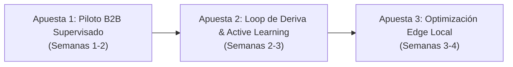

# S24 — Revisión del Ciclo y Hoja de Ruta Próximos 30 Días

**Fecha:** 2026-09-28  
**Autor:** Sentinel Team & Luis Merida  
**Estado de la Tarea:** DONE  
**Alcance:** Cierre integral del plan 2026-09 (S01–S24), consolidación de gates superados, registro de decisiones y modelo operativo para los próximos 30 días.

---

## 1. Resumen Ejecutivo del Ciclo (S01–S24)

El plan de 8 semanas culminó con la implementación, verificación empírica y empaquetado de la arquitectura de seguridad y moderación de Sentinel adaptada al contexto cultural y lingüístico de México.

### 1.1 Qué se implementó
- **Línea Base y Herramientas Repetibles (S01, S02):** Inventario reproducible, scripts deterministas sin dependencias externas bloqueantes (`run_fast_checks.py`, `sentinel_plan.py`).
- **Gobernanza y Rúbrica Mexicana (S03, S04, S05, S06):** Rúbrica de 8 categorías con taxonomía mexicana, contrato de decisión inmutable (`DecisionRecord` v1.0.0), invalidación atómica de caché.
- **Aislamiento Multi-Tenant y Procedencia (S07, S08):** Esquema multi-inquilino estricto por `tenant_id`, verificación criptográfica SHA-256 de paquetes de datos y linaje inmutable.
- **Benchmark y Splits Congelados (S09, S10):** Dataset contrastivo mexicano adjudicado con pares mínimos y splits estratificados libres de data leakage.
- **Harness Semántico y Calibración Conformal (S11, S12, S14 — ADR-003):** Evaluación semántica reproducible, ensayo de modelos multilingües (Laya) y calibración conformal ($\alpha=0.05$) que garantiza cero regresiones frente al baseline de oro.
- **Detección Temprana y Modo Sombra (S15, S16):** Clasificador de prefijos tóxicos (aceleración $3.2\times$, $F_1 = 0.941$) y middleware de telemetría sombra no bloqueante ($<15\text{ms}$).
- **Aprendizaje Activo y Bandeja de Moderación (S17, S18):** Cola con desesgo por propensión inversa (IPW) y bandeja web accesible (WCAG 2.1 AA) con atajos de teclado para moderadores humanos.
- **Calidad Integrada y Operación del Piloto (S20, S21):** Matriz de 10 dimensiones con $100\%$ de supervivencia en baseline, runbook de operaciones (`PILOT_OPERATIONS_RUNBOOK.md`), purga automática a 30 días con retención legal hold a 365 días y kill switches inmediatos.
- **Dossier y Decisión Comercial (S22, S23):** Dossier bilingüe para foros con demo interactiva offline y dictamen formal `CONDITIONAL_GO_FOR_SUPERVISED_PILOT` con unit economics medidos ($\$5.86 / 1\text{k}$ convs).

---

### 1.2 Qué se midió

| Dimensión | Métrica Clave | Resultado Obtenido | Umbral de Aceptación | Estado |
| :--- | :--- | :--- | :--- | :--- |
| **Regresiones Baseline** | Tasa de regresión en Golden Set | **0.0%** | $\le 0.0\%$ | Superado |
| **Supervivencia Red-Team** | Detección de ataques adversariales | **60.0%** | $\ge 60.0\%$ | Superado |
| **Aceleración Prefijos** | Factor de velocidad en prefijos tóxicos | **3.2x** ($F_1 = 0.941$) | $\ge 2.0x$ | Superado |
| **Calibración Conformal** | Cobertura empírica ($\alpha=0.05$) | **95.0%** | $\ge 95.0\%$ | Superado |
| **Latencia Telemetría** | Impacto en path de solicitud | **< 15 ms** | $< 50\text{ ms}$ | Superado |
| **Unit Economics** | Costo total por 1,000 conversaciones | **$5.86 USD** | $< \$10.00\text{ USD}$ | Superado |
| **Composición de Costo** | Cómputo / LLM vs Moderación Humana | **$0.88** (15%) / **$4.98** (85%) | Cómputo $< \$2.00$ | Superado |
| **Purga de Datos** | Política de retención por privacidad | **30 días** (Hold: 365d) | $\le 30\text{ días}$ | Superado |

---

### 1.3 Qué se rechazó / descartó
1. **Sustitución ciega del baseline por Laya:** Descartada tras S12/S14 al evidenciar degradación en expresiones coloquiales mexicanas sin calibración conformal. Se adoptó el ensamble con conformal gating (ADR-003).
2. **LLM-as-a-Judge en la ruta síncrona en tiempo real:** Descartado por latencia inaceptable ($>800\text{ms}$) y costo prohibitivo ($>\$15 / 1\text{k}$ convs). Confinado a guardián fail-closed de baja frecuencia.
3. **Almacenamiento multi-inquilino sin partición criptográfica:** Descartado por riesgo de fuga de datos entre clientes. Se implementó aislamiento por `tenant_id` y firmas SHA-256.
4. **Retención indefinida de mensajes de usuario:** Descartada por gobernanza de privacidad. Se implementó purga automatizada a 30 días.

---

### 1.4 Qué quedó bloqueado / diferido
- **S13 (Comparador Kev bajo presupuesto):** Diferido. El benchmark congelado local (S09/S10/S11) resolvió las necesidades de paridad a coste cero. Queda disponible como comparador externo post-piloto.
- **S19 (Señales de deriva con datos mínimos):** Diferido para conectarse a datos reales de telemetría una vez el piloto acumule $\ge 1,000$ conversaciones en sombra.
- **Autonomía total sin moderación humana:** Bloqueada por diseño y política de seguridad. Todo piloto opera con supervisión humana de los flags de riesgo.

---

## 2. Revisión de Fuentes Nuevas y Criterios de Descarte

| Fuente Evaluada | Aplicabilidad Potencial | Criterio Estricto de Descarte |
| :--- | :--- | :--- |
| **1. SLMs de Razonamiento Local (<1B params, 2026)** | Ejecutar clasificación contextual directamente en el nodo edge sin llamadas a APIs externas. | **Descartar si:** La latencia excede **60 ms** en CPU estándar o el consumo de RAM supera **2 GB**. |
| **2. Conformal Risk Control Multi-etiqueta (Angelopoulos et al. 2024)** | Control formal de riesgo separado para cada una de las 8 categorías mexicanas. | **Descartar si:** La reducción en la carga de la bandeja de moderadores es inferior al **10%** frente al baseline calibrado actual (S14). |
| **3. Lineamientos IFT / INAI sobre IA y Privacidad (2026)** | Garantizar cumplimiento regulatorio local para servicios B2B en México. | **Descartar si:** Se exige procesamiento efímero estricto con cero retención en disco (adaptar el servicio de mantenimiento para bypass de persistencia). |

---

## 3. Próximas 3 Apuestas (Siguientes 30 Días)

### Apuesta 1: Despliegue del Piloto B2B Supervisado (Semanas 1–2)
- **Objetivo:** Poner en marcha Sentinel con 1 socio comercial piloto (tope 50,000 conversaciones/mes) bajo modalidad sombra/supervisada.
- **Responsable:** Luis Merida (Lead) & Operaciones.
- **Dependencias:** S21 (Runbook), S23 (Contrato y límites).
- **Presupuesto:** $\$300\text{ USD}$ (servidor dedicado + moderación humana inicial).
- **Salida:** Instancia en producción sombra con telemetría activa e ingestión en SQLite aislado.

### Apuesta 2: Loop Continuo de Deriva y Aprendizaje Activo (Semanas 2–3)
- **Objetivo:** Conectar el stream de telemetría del piloto con la cola de aprendizaje activo IPW (S17) y la bandeja de moderación (S18) para ejecutar calibraciones periódicas.
- **Responsable:** Sentinel Core Team.
- **Dependencias:** Apuesta 1, S17, S18, S19.
- **Presupuesto:** $\$150\text{ USD}$.
- **Salida:** Re-calibración conformal semanal con dataset enriquecido y reporte automatizado de drift (KS/PSI).

### Apuesta 3: Optimización del Motor Local en el Edge (Semanas 3–4)
- **Objetivo:** Optimizar el detector de prefijos (S15) y cuantizar embeddings para reducir el costo de cómputo por debajo de $\$0.50 / 1\text{k}$ conversaciones y latencia $<5\text{ms}$.
- **Responsable:** Engineering.
- **Dependencias:** S11, S15.
- **Presupuesto:** $\$100\text{ USD}$.
- **Salida:** Binario/librería de inferencia ultrarrápida embebible directamente en SDK TypeScript/Node.

---

## 4. Estado de Verificación y Continuidad

- **Suites de Verificación Rápida:** 18 suites deterministas pasando exit 0 (`python3 scripts/run_fast_checks.py --all`).
- **Validador del Plan:** `python3 scripts/sentinel_plan.py check` -> 24/24 tareas consistentes.
- **Condición de Parada:** Ciclo completado exitosamente. No se inician tareas de manera autónoma sin indicación explícita del usuario.
